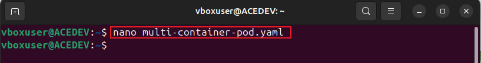
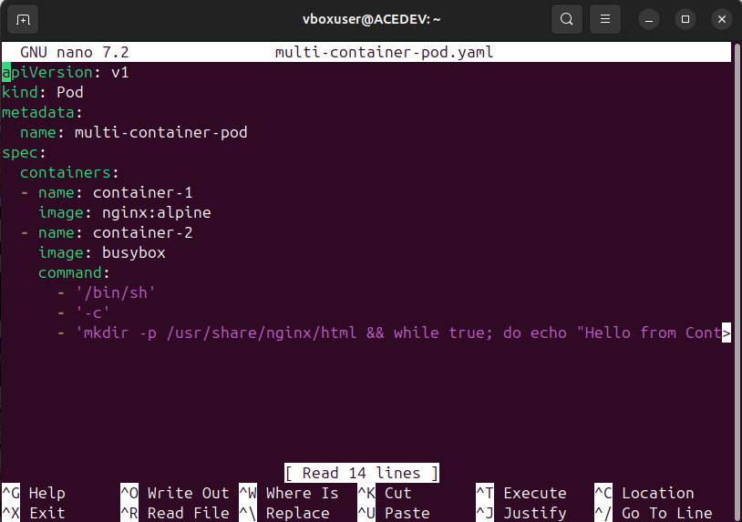
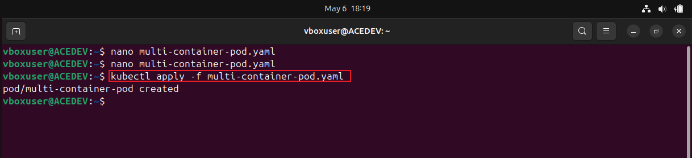
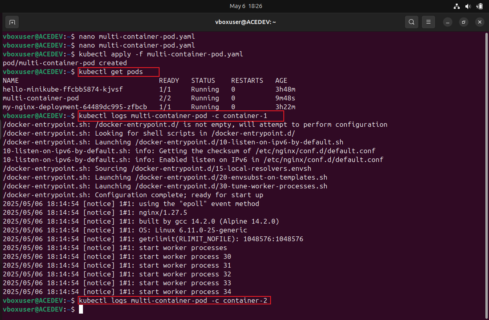

# Networking-Kuberentes

The project provides a hands-on project, guiding through deploying a multi-container pod to demonstrate internal networking. It includes a sample YAML configuration, commands for applying the setup, and methods to check logs and interact with running containers.

#  STEP 1: Create a multi-container pod yaml file "multi-container-pod.yaml" and paste the script in it

    nano multi-container-pod.yaml

script :

    apiVersion: v1
    kind: Pod
    metadata:
      name: multi-container-pod
    spec:
     containers:
      - name: container-1
        image: nginx:alpine
      - name: container-2
    image: busybox
    command:
      - '/bin/sh'
      - '-c'
      - 'mkdir -p /usr/share/nginx/html && while true; do echo "Hello from Container 2" >> /usr/share/nginx/html/index.html; sleep 10; done'

# STEP 2: APPLY POD Configuration
   
     kubectl apply -f multi-container-pod.yaml

# STEP 3: Check POD Status and Logs
   
    kubectl get pods
    kubectl logs multi-container-pod -c container-1
    kubectl logs multi-container-pod -c container-2

# STEP 4: Access Nginx from BusyBox Container
   
    kubectl exec -it multi-container-pod -c container-2 -- /bin/sh

